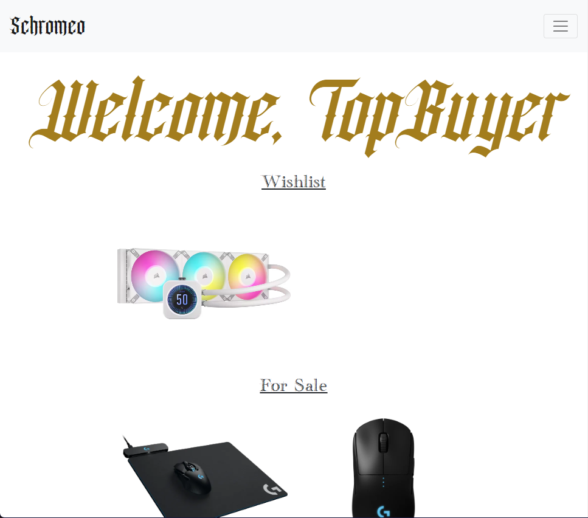

# final-project-master-CS5610
This is the final project for CS5610. A web app based on React.

## Author
Yisong Cheng [@schromeo](https://github.com/Schromeo/)

## UML Structure

## Website Description

This is an online store website using ASOS as an external API.  

## Guest Homepage

An anonymous user can view and search the contents without login.

## Sign Up Page

A user can choose to sign up as a buyer or a seller.
The information needed for signing up are Username, Email, and Password.

Here's an example of signing up as a seller.

 

## Login Page

A user can log in with their registered E-mail and password.

## Search Page

The external API for the searching method is from ASOS API. 

## User Homepage

Different role of User has a different version of the home page.

### Buyer Homepage

A buyer's homepage displays the wishlist at the homepage.

